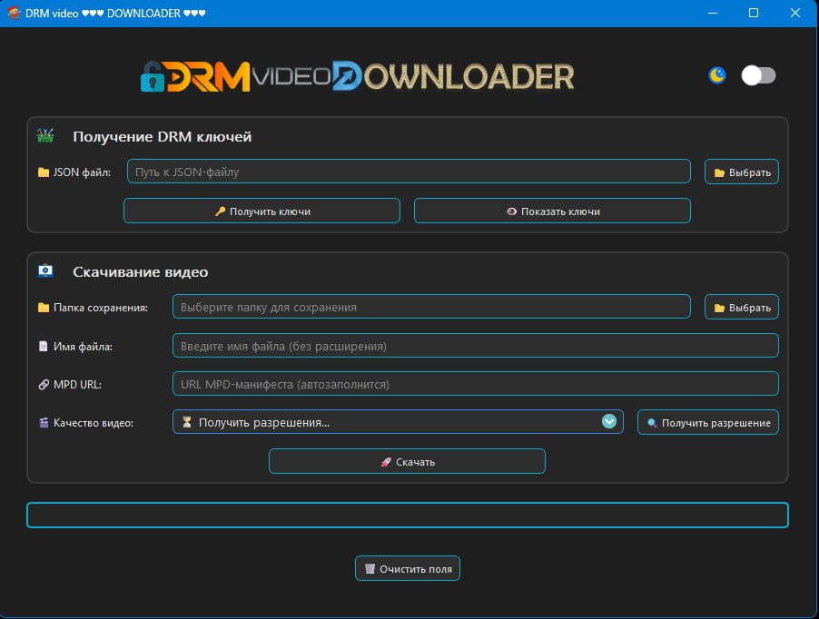

# ••• DRM-VIDEO-DOWNLOADER •••

:rocket: **DRM-VIDEO-DOWNLOADER** — это мощный инструмент и библиотека на Python, предназначенные для загрузки и дешифрования контента с DRM-защитой из манифестов JSON.

:gear: **DRM-VIDEO-DOWNLOADER** обеспечивает эффективную поддержку зашифрованных медиапотоков, извлечение метаданных и высокую совместимость с различными стандартами DRM

:book: *Если у вас возникли вопросы, вы можете задать их в группе телеграм* **<a href="https://clck.ru/3QSzp4" target="_blank">FAQDownloadEncryptedVideo</a>**

 *или нужна помощь, обратитесь в группу телеграм* **<a href="https://clck.ru/3QSzp4" target="_blank" rel="noopener noreferrer">FAQDownloadEncryptedVideo</a>**

1. Не используйте DRM-VIDEO-DOWNLOADER в целях, на которые у вас нет прав.
2. Не распространяйте и не запрашивайте контент, нарушающий авторские права;
   1. это включает ключи предоставления Widevine, ключи шифрования контента или вызовы API сервисов или код.

:rocket: **DRM-VIDEO-DOWNLOADER** is a powerful Python tool and library designed to download and decrypt DRM-protected content from JSON manifests.

:gear: **DRM-VIDEO-DOWNLOADER** provides efficient support for encrypted media streams, metadata extraction, and high compatibility with various DRM standards

:book: *If you have any questions, you can ask them in the telegram group* **<a href="https://clck.ru/3QSzp4" target="_blank">FAQDownloadEncryptedVideo</a>**

 *or need help, please contact the telegram group* **<a href="https://clck.ru/3QSzp4" target="_blank" rel="noopener noreferrer">FAQDownloadEncryptedVideo</a>**

1. Do not use DRM-VIDEO-DOWNLOADER for purposes for which you do not have the rights.
2. Do not distribute or request content that infringes on copyright;
 1. This includes Widevine provision keys, content encryption keys, or API service calls or code.

 
